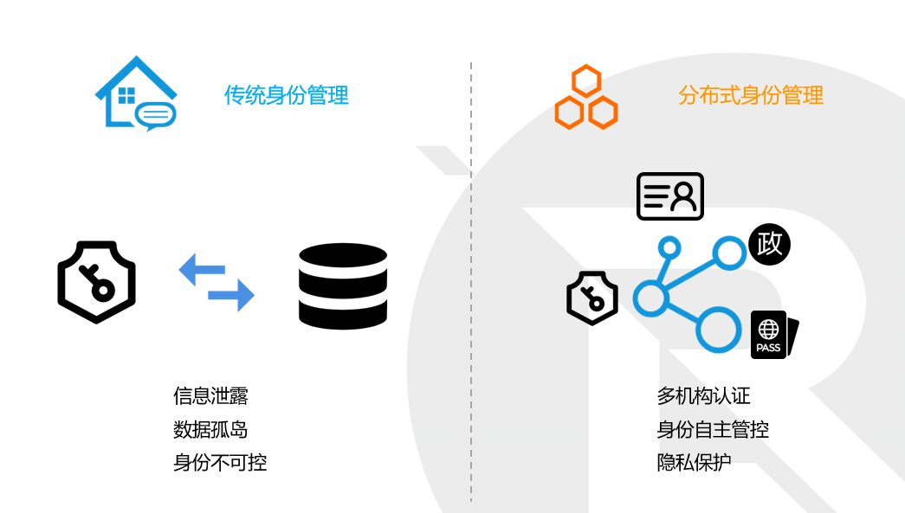

# MaskID分布式身份管理平台

### 产生背景

传统的中心化的身份管理系统面临以下挑战：

- 个人身份信息被存储于中心系统，容易造成泄露和隐私受到侵犯；
- 各中心互不相通，形成数据孤岛，重复开发导致成本提高，增大安全风险；
- 用户对自身身份数据失去了自主控制权，数据流向无法追溯。

分布式数字身份标识符（DID）是由字符串组成的标识符，用来代表一个数字身份，它是一种去中心化可验证的标识符，实体可自主完成 DID的注册、解析、更新或者撤销操作，不需要中央注册机构就可以实现全球唯一性。通常，一个实体可以拥有多个身份，由实体自己进行管理、维护，不同的身份之间没有关联信息，可有效避免身份信息被第三方归集。

区块链具有不可篡改、公开透明、便于追踪溯源等技术特点，实现基于区块链的分布式身份管理，赋予用户基于现实身份生成的数字身份DID，能有效解决用户身份的安全和隐私问题，因为DID不包含用户真实数据，避免用户数据的泄露。DID是用户的数字“身份证”，由用户自主控制，能实现身份在各系统的联通和高效便捷的业务拓展，打通数据身份的关联。 

在这种背景下，`MaskID`应运而生！

### 什么是MaskID？

`MaskID`是一套基于区块链的去中心化身份管理平台，其目的是为用户和上层应用构建一个公开透明、可信的底层架构，满足不同场景下身份的可信、可验证需求。该平台通过结合零知识证明、新型`DPKI`撤销机制等技术，实现实体身份的自主控制和保护隐私的安全认证、授权和数据交换。

`MaskID`可以保护用户的数字身份自主控制，隐私信息不被泄露，满足用户身份的安全隐私需求。用户可以通过`MaskID`平台生成自己的`DID`身份，并向发行者申请多个不同功能、不同场景的身份凭证，利用隐私保护的方式认证、实现身份在各系统的连通，能高效便捷地拓展业务。各机构实体也可以高效地颁发，存证，流转证明，以实现运营效率的提升。

### 模块介绍

`MaskID`身份管理系统一共分为四层：最底层为密码信任，主要使用区块链，负责分布式存储；第二层为合约通信，主要实现`DID`的点对点相互认证；第三层为认证安全，相当于一个分布式PKI系统（`DPKI`）；第四层为应用层，包含发证方注册、证书模板注册等应用。

基于密码信任的区块链层，是整个系统的基础。分布式存储中保存的是Credential凭证的Hash值。

使用智能合约通信，不同用户间可实现不依赖于可信第三方的安全通信。通过将用户的DID标识符和DID文档的hash摘要上链，注册到区块链的分布式账本，做到公开可验证，从而实现基于 DID的身份认证。并结合智能合约实现DID注册、解析、撤销等功能。

认证安全，即进行可信交换，是MaskID系统中各参与方互相建立安全身份认证与数据交换层，可以看作一个`DPKI`系统。我们使用国密算法对数据进行加密，使用自主研发的零知识证明进行身份验证。

应用安全，是用户最终接触的可视化操作界面，为用户使用`MaskID`身份管理系统提供便捷的接入口。

### 运行设计

#### 交互模型

DID身份管理系统的实体涉及发证方机构、验证者和系统用户。特别地，该系统中引入了`eID`系统作为最高等级的发证方机构，其颁发的`eID`身份作为最高等级的DID身份：

| **角色**          | **说明**                                                     |
| ----------------- | ------------------------------------------------------------ |
| User (Entity)用户 | 用户（实体）。注册属于自己的DID，申请Credential，并通过出示给相关业务方来使用之。 |
| Issuer 发证方     | Credential的发行者。首先验证实体对DID的所有权，其次发行Credential交给实体。 |
| Verifier 验证者   | Credential的使用者。首先验证实体对DID的所有权，其次验证Credential的有效性。 |

用户（实体）会注册属于自己的DID，申请Credential，并通过出示给相关业务方来使用之。系统用户指DPKI系统中DID、Credential的持有者，是资源和服务的消费者。

发证方指Credential的发行者，可以是机构也可以是个人。他们会首先验证实体对DID的所有权，其次发行Credential交给实体发证方机构提供Credential颁发服务，作为颁发者签发Credential。发证方可分为eID系统和其他发证方。

Credential的验证者一般指能通过DID接入的第三方应用，例如网站、移动APP等。他们会首先验证实体对DID的所有权，其次验证Credential的有效性。系统用户指资源和服务的消费者。主要涉及活动包括DID生成和验证Credential。

他们之间的交互模型见下图所示：

#### 程序流程

我们的主程序运行流程图如下所示：

`MaskID`利用区块链具有不可篡改、公开透明、便于追踪溯源等技术特点，采用由字符串组成的标识符，赋予用户基于现实身份生成的数字身份DID，这是一种去中心化可验证的标识符，实体可自主完成 DID的注册、解析、更新或者撤销操作，不需要中央注册机构就可以实现全球唯一性。通常，一个实体可以拥有多个身份，由实体自己进行管理、维护，不同的身份之间没有关联信息，可有效避免身份信息被第三方归集。系统中的实体主要包括系统用户、系统发证方和验证者，他们之间的运行方式如下：

### 核心技术

我们使用到的关键技术：

- 遵循[W3C DID规范](https://w3c-ccg.github.io/did-spec/)，研发`MaskID`平台；

- 全国密算法，安全高效可用；
- 自主研发的零知识证明体系，有效保护用户的身份、隐私；

### 联系我们

邮箱：[market@xdlianrong.com](mailto:market@xdlianrong.com)

